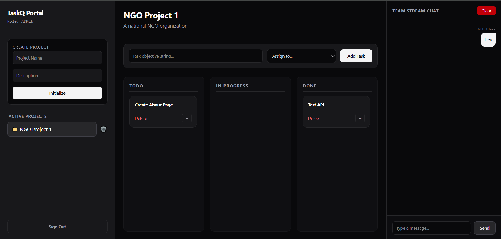

# TaskQ - Real-Time Team Collaboration Platform

## Overview

TaskQ is a real-time team collaboration and task management platform that enables teams to manage projects, assign tasks, track progress through a Kanban board, and communicate instantly using live chat.

The application supports role-based access control, allowing Admins and Managers to create projects, assign tasks, and manage team workflows, while Members can view and update their assigned work.

---
### Dashboard


## Features

### Authentication & Authorization

* Secure user authentication
* Role-based access control
* Admin, Manager, and Member roles

### Project Management

* Create projects
* View active projects
* Delete projects
* Persistent project storage using MongoDB

### Task Management

* Create tasks
* Assign tasks to team members
* Update task status
* Delete tasks
* Kanban board workflow

  * Todo
  * In Progress
  * Done

### Real-Time Communication

* Team chat system
* Live message updates using Socket.IO
* Auto-scroll to latest messages
* Clear chat functionality

### Responsive Design

* Mobile-friendly dashboard
* Responsive Kanban layout
* Adaptive navigation and chat panel

---

## Tech Stack

### Frontend

* React.js
* Vite
* Tailwind CSS
* Axios
* React Hot Toast
* Socket.IO Client

### Backend

* Node.js
* Express.js
* MongoDB
* Mongoose
* Socket.IO
* JWT Authentication

### Deployment

* Frontend: Netlify
* Backend: Render
* Database: MongoDB Atlas

---

## Installation

### Clone Repository

```bash
git clone <repository-url>
cd TaskQ
```

### Backend Setup

```bash
cd backend

npm install

npm run dev
```

Create a `.env` file:

```env
PORT=5050
MONGODB_URI=your_mongodb_connection_string
JWT_SECRET=your_jwt_secret
```

### Frontend Setup

```bash
cd frontend

npm install

npm run dev
```

Create a `.env` file:

```env
VITE_API_URL=http://localhost:5050/api
VITE_SOCKET_URL=http://localhost:5050
```

---

## API Endpoints

### Projects

```http
GET    /api/projects
POST   /api/projects
DELETE /api/projects/:id
```

### Tasks

```http
GET    /api/tasks
POST   /api/tasks
PUT    /api/tasks/:id
DELETE /api/tasks/:id
```

### Messages

```http
GET    /api/messages
POST   /api/messages
DELETE /api/messages/clear
```

### Users

```http
GET /api/users
GET /api/users/me
```

---

## Deployment

### Backend (Render)

1. Push code to GitHub
2. Create a Render Web Service
3. Select backend folder
4. Configure environment variables
5. Deploy

### Frontend (Netlify)

1. Connect GitHub repository
2. Select frontend folder
3. Build command:

```bash
npm run build
```

4. Publish directory:

```bash
dist
```

5. Add environment variables:

```env
VITE_API_URL=<render-backend-url>/api
VITE_SOCKET_URL=<render-backend-url>
```

---

## Future Improvements

* Drag-and-drop Kanban board
* File attachments
* Notifications
* Team management module
* Activity logs
* Dark/Light theme support

---

## Author

Piyush Agrawal

Frontend & Full Stack Developer

Built as a real-time collaboration platform using the MERN stack and Socket.IO.
